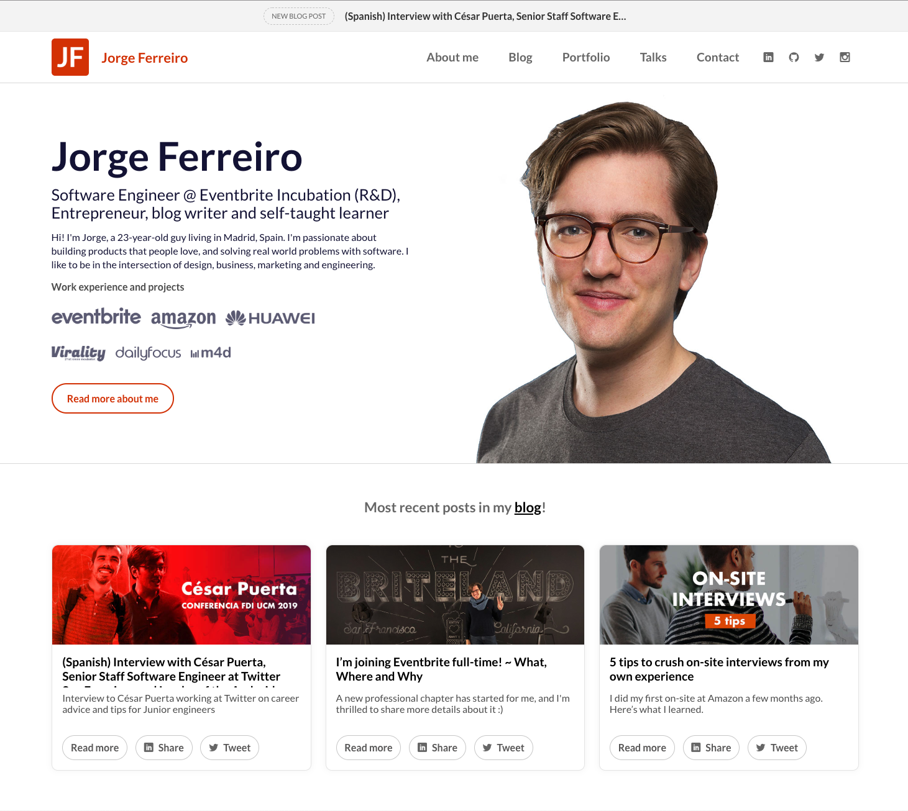
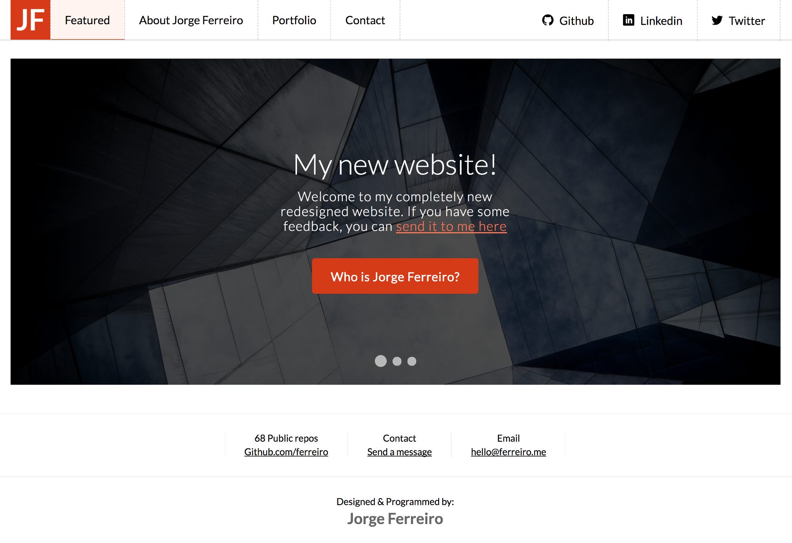
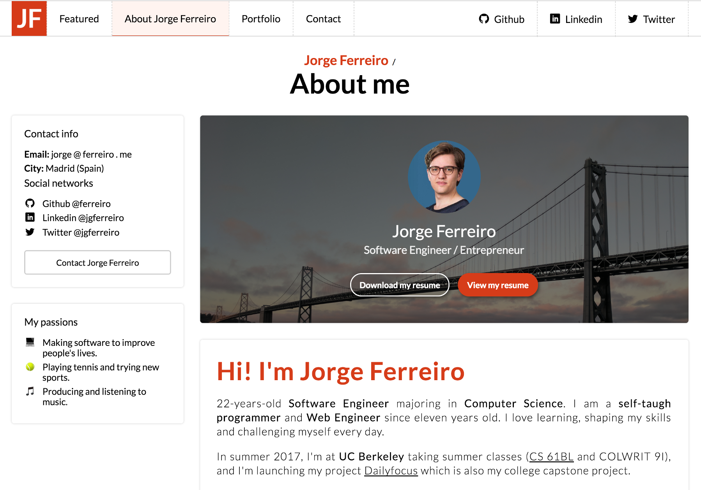
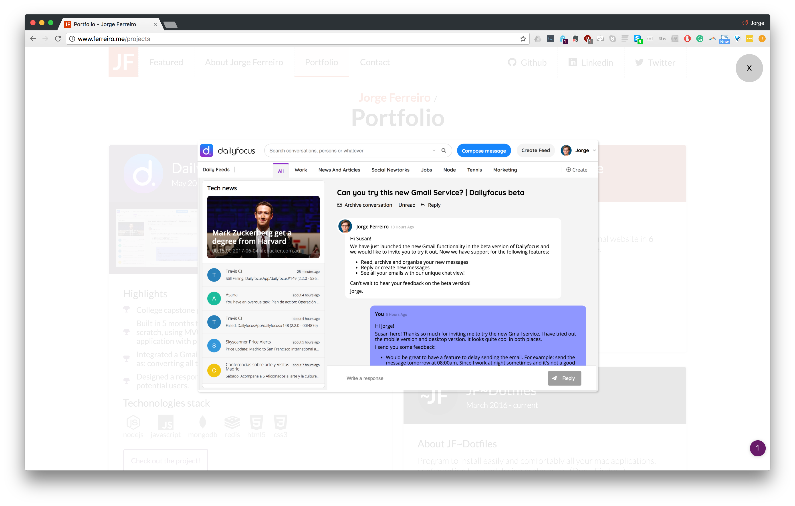

# Jorge Ferreiro website

Open source project that runs the website for Jorge Ferreiro, including the blog and the admin panel.

**Features:**

- Blog.
- Adming panel.
- Projects/Portfolio.
- Contact form.
- Subscription modal with Mailchimp.
- Image uploader with AWS.



**Disclaimer:** This documentation is a Work In Progress.

## Cross browser testing with BrowserStack


The blog post is getting thousands of readers. In order to make sure that we are able to offer the best possible experience across multiple devices we have teamed up with BrowserStack, a really powerful tool for performing cross browser testing.

## Run the server

We have all the configuration for beta and prod inside `./env/index.js`, there we load 2 files, the production or the development.

1. You'll need to create a `.env` file to set the required variables:
  ```
  NODE_ENV='DEV'
  SESSION_SECRET='keyboard cat'

  PORT=''
  MONGODB_URI=''
  ADMIN_EMAIL=''
  ADMIN_PASS=''
  MAILCHIMP_API_TOKEN=''

  S3_REGION=''
  S3_BUCKET=''
  AWS_ACCESS_KEY_ID=''
  AWS_SECRET_ACCESS_KEY=''

  CONTACT_EMAIL=''
  MAILGUN_USER=''
  MAILGUN_PASS=''
  RECAPTCHA_PUBLIC=''
  RECAPTCHA_SECRET=''
  NEW_RELIC_LICENSE_KEY=''
  ```
2. Source `.env`
3. Run the server `yarn dev`

## Changelog

### Version 3.5 (December 2018)

* Fully refactor the codebase to use a Ducks pattern. Instead of controllers.js, routes.js, you'll find one folder per functionality. Also, there were some refactors from the web server to the API.

* Revamp completely sections headers and the following sections: home, about and talks.
* Now the blog has a sidebar with useful links, extra information.
* Added new biography.

### Version 3 (fall 2017)

Release date: 17th October 2017

* [v3.0.0 Download](https://github.com/ferreiro/website/releases/tag/v3.0.0)

V3, level up Jorge Ferreiro: The content has arrived.

* Create my personal Blog.
* Added tools to improve development time (Gulp, config files...)
* Improve discoverability: social networks.
* Content oriented: new bio.
* Improved UX by polishing the UI: less is more.
* General refactors to improve Architecture.
* Hello SSL!

### Version 2 (October 2016)

* [v2.0.0 Download](https://github.com/ferreiro/website/releases/tag/v2.0.0)
* [v2.0.1 Fixes](https://github.com/ferreiro/website/tree/v2.0.1)
* [v2.0.2 Fixes (last fixes)](https://github.com/ferreiro/website/tree/dce56266f19644ea1b3560829b1a74f6b5c25a2a)







### Version 1 (Early 2016 - Sep 25, 2016)

