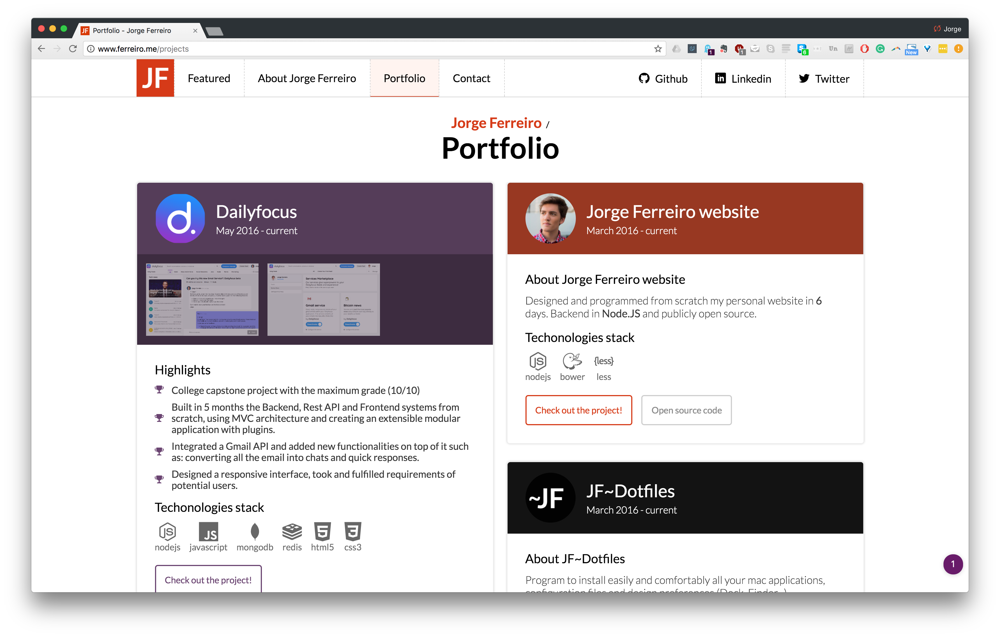
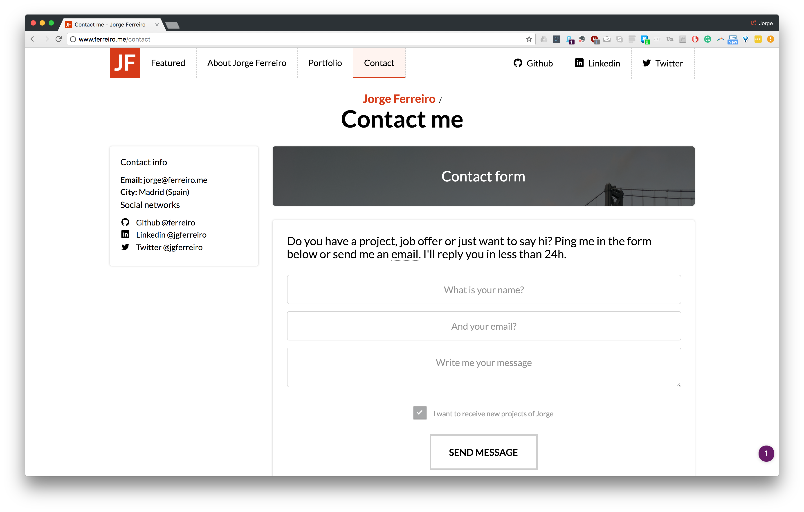

# Jorge Ferreiro website

## Biography types

I created a system to define my own datatypes so the view can parse and behave differently given the data type.

Attributes:
- icon*: the name of the icon
- body*: text or description of the entry.
- type: my own data types for each entry in the description.
  * entry: a single line.
  * bullets: 1 or more entries.
  * warning: a special type, when you want to highlight something on your entry.
    Warnings have extra attributes:
    ```js
    link: {
      url: "http://test.dailyfocus.io",
      target: "blank"
    }
    ```

(*) means this attribute can be nullable. In this case, just set the value to null.

``` js
description: [
  {
    type: "warning",
    icon: null,
    body: "Test out my work! http://test.dailyfocus.io",
    link: {
      url: "http://test.dailyfocus.io",
      target: "blank"
    }
  },
  {
    type: "entry",
    icon: "ion-chatbox-working",
    body: "Bachelor's degree in Computer Science."
  },
  {
    type: "bullets",
    icon: null,
    body: [
      {
        type: "entry",
        icon: "ion-chatbox-working",
        body: "CS 61BL: Data Structures and Programming Methodology."
      },
      {
        type: "entry",
        icon: null,
        body: "COLWRIT 9: Conflict Resolution and Communication Skills."
      }
    ]
  }
]
```

        {
          type: "warning",
          icon: null,
          body: "Test out my work! http://test.dailyfocus.io",
          link: {
            url: "http://test.dailyfocus.io",
            target: "blank"
          }
        },

      description: [
        {
          type: "entry",
          icon: "ion-chatbox-working",
          body: "Bachelor's degree in Computer Science."
        },
        {
          type: "bullets",
          icon: null,
          body: [
            {
              type: "entry",
              icon: "ion-chatbox-working",
              body: "CS 61BL: Data Structures and Programming Methodology."
            },
            {
              type: "entry",
              icon: null,
              body: "COLWRIT 9: Conflict Resolution and Communication Skills."
            }
          ]
        }
      ]


## Changelog

### Version 3 (fall 2017)

**Work in progress**

V3, level up Jorge Ferreiro: The content has arrived.

[ ] Create my personal Blog.
[ ] Added tools to improve development time (Gulp, config files...)
[ ] Improve discoverability: social networks.
[ ] Content oriented: new bio.
[ ] Improved UX by polishing the UI: less is more.
[ ] General refactors to improve Architecture.
[ ] Hello SSL!

### Version 2 (October 2016)

[v2.0.0 Download](https://github.com/ferreiro/website/releases/tag/v2.0.0)
[v2.0.1 Fixes](https://github.com/ferreiro/website/tree/v2.0.1)
[v2.0.2 Fixes (last fixes)](https://github.com/ferreiro/website/tree/dce56266f19644ea1b3560829b1a74f6b5c25a2a)






### Version 1 (Early 2016 - Sep 25, 2016)